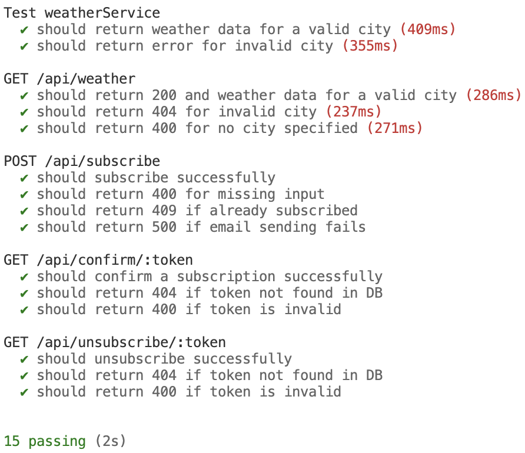

# Weather API

A TypeScript-based Weather API application that allows users to subscribe to weather updates for their chosen city. Users can receive updates via email at their preferred frequency (hourly or daily).

## Table of Contents

- [Features](#features)
- [Tech Stack](#tech-stack)
- [Setup and Installation](#setup-and-installation)
  - [Using Docker](#using-docker)
  - [Local Development](#local-development)
- [Environment Variables](#environment-variables)
- [Usage](#usage)
  - [API Endpoints](#api-endpoints)
  - [Swagger Documentation](#swagger-documentation)
- [Testing](#testing)
- [Implementation Logic](#implementation-logic)

---

## Features

- Get current weather data for any city.
- Subscribe to weather updates via email.
- Confirm subscriptions via email.
- Unsubscribe from weather updates.
- Scheduled weather updates.
- API documentation with Swagger
- Containerized with Docker
- Database migrations with Knex.js


## Tech Stack

### Integrations

- **[WeatherAPI.com](https://www.weatherapi.com/):** Used to fetch real-time weather data for cities.
- **Gmail SMTP (via NodeMailer):** Used for sending subscription confirmation emails and weather updates.

### Libraries

- **[Express](https://expressjs.com/):** Web framework for building the API.
- **[Knex](https://knexjs.org/):** SQL query builder for managing PostgreSQL database interactions.
- **[NodeMailer](https://nodemailer.com/):** For sending emails via Gmail SMTP.
- **[node-cron](https://www.npmjs.com/package/node-cron):** For scheduling weather update emails.
- **[Mocha](https://mochajs.org/):** Test framework for writing and running unit tests.


## Setup and Installation

### Using Docker

1. Clone the repository:
   ```bash
   git clone https://github.com/alexvarko/weather-api.git
   cd weather-api
   ```

2. Update environment variables in `docker-compose.yml` with your actual values.

3. Build and start the containers:
   ```bash
   docker-compose up -d
   ```

4. Access the application at [http://localhost:3000](http://localhost:3000).

### Local Development

1. Clone the repository:
   ```bash
   git clone https://github.com/alexvarko/weather-api.git
   cd weather-api
   ```

2. Install dependencies:
   ```bash
   npm install
   ```

3. Create a `.env` file from the template:
   ```bash
   cp .env.example .env
   ```

4. Update the `.env` file with your actual values.

5. Create a PostgreSQL database and update the connection details in `.env`.

6. Run database migrations:
   ```bash
   npm run migrate
   ```

7. Start the development server:
   ```bash
   npm run dev
   ```

8. Access the application at [http://localhost:3000](http://localhost:3000).


## Environment Variables

The application requires the following environment variables to be set in a `.env` or in `docker-compose.yaml`:

| Variable                | Description                                | Default Value              |
|-------------------------|--------------------------------------------|----------------------------|
| `NODE_ENV`              | Application environment                   | `development`              |
| `PORT`                  | Port for the server                       | `3000`                     |
| `HOST_URL`              | Base URL of the application               | `http://localhost:3000`    |
| `DB_HOST`               | Database host                             | `localhost`                |
| `DB_PORT`               | Database port                             | `5432`                     |
| `DB_NAME`               | Database name                             | `weather`                  |
| `DB_USER`               | Database username                         | `weather`                  |
| `DB_PASSWORD`           | Database password                         | `weather`                  |
| `WEATHER_API_BASE_URL`  | Base URL for the weather API              | `http://api.weatherapi.com/v1/` |
| `WEATHER_API_KEY`       | API key for the weather API               | set your api key           |
| `SMTP_EMAIL_FROM`       | Sender email address                      | set your smtp email        |
| `SMTP_HOST`             | SMTP server host                          | `smtp.gmail.com`           |
| `SMTP_PORT`             | SMTP server port                          | `465`                      |
| `SMTP_USER`             | SMTP username                             | set your smtp user         |
| `SMTP_PASSWORD`         | SMTP password                             | set your smtp password     |


## Usage

### API Endpoints

The following API endpoints are available:

| Endpoint                  | Method | Description                                   |
|---------------------------|--------|-----------------------------------------------|
| `/api/weather`            | GET    | Get current weather for a city               |
| `/api/subscribe`          | POST   | Subscribe to weather updates                 |
| `/api/confirm/:token`     | GET    | Confirm email subscription                   |
| `/api/unsubscribe/:token` | GET    | Unsubscribe from weather updates             |

### Swagger Documentation

Swagger documentation is available at [http://localhost:3000/api-docs](http://localhost:3000/api-docs).


## Testing

Run the test suite using the following commands:

1. Install dependencies:
   ```bash
   npm install
   ```
2. Run tests:
   ```bash
   npm test
   ```

You will see report like:
<p align="center">
   
</p>

The tests are located in the `src/tests` directory and cover various functionalities, including weather fetching, subscriptions, and email notifications.


## Implementation Logic

The application follows these main workflows:

### Weather Data Retrieval
- Fetches weather data from WeatherAPI.com
- Formats the response to match the API contract
- Handles error cases like invalid cities

### Subscription Flow
1. User submits subscription request with email, city, and frequency
2. System validates the city against WeatherAPI.com
3. System checks if the subscription already exists
4. System creates a new subscription record with confirmation and unsubscribe tokens
5. System sends a confirmation email with the confirmation token
6. User clicks the confirmation link to activate the subscription

### Weather Update Schedule
- Hourly scheduler runs every hour to send updates to hourly subscribers
- Daily scheduler runs at 8 AM to send updates to daily subscribers
- System fetches the current weather for each subscriber's city
- System sends customized email updates with unsubscribe links

### Unsubscribe Flow
1. User clicks the unsubscribe link in any weather update email
2. System verifies the unsubscribe token
3. System removes the subscription from the database
4. User receives confirmation of unsubscription
